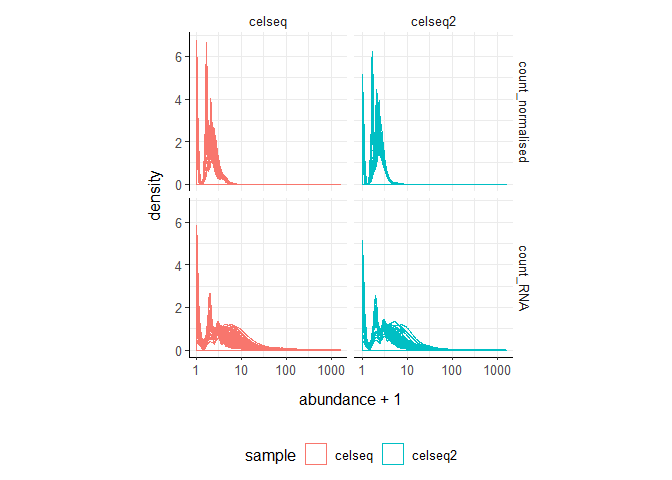
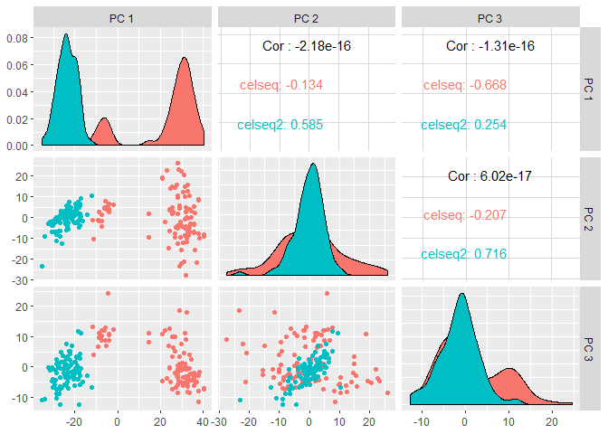
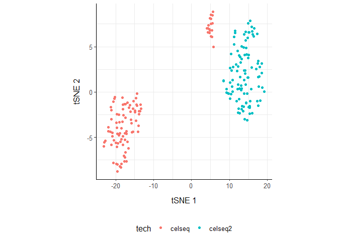
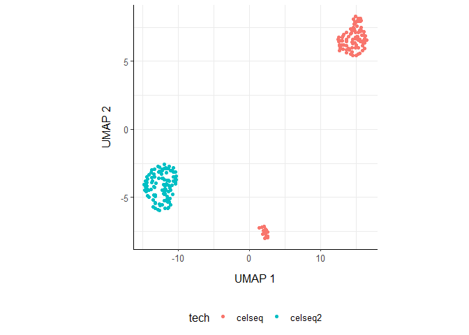
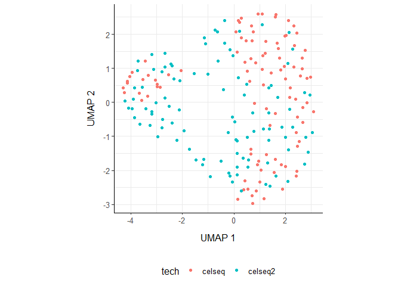
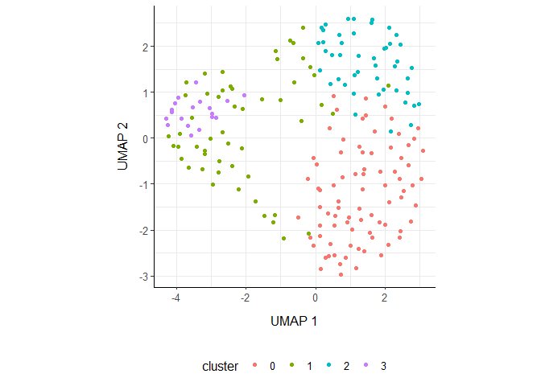
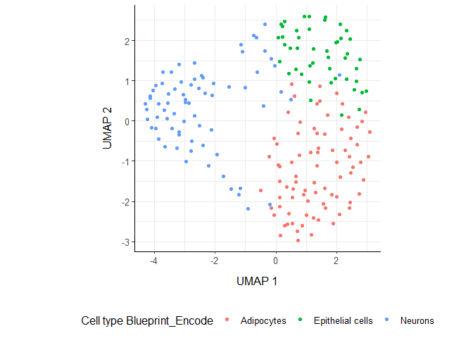

ttSc - tidyTranscriptomics
================

[](https://travis-ci.org/stemangiola/ttSc)
[](https://coveralls.io/github/stemangiola/ttSc?branch=master)

A user-friendly grammar of bulk RNA sequencing data exploration and
processing

# 

# Introduction

ttSc is a collection of wrapper functions for bulk tanscriptomic
analyses that follows the “tidy” paradigm. The data structure is a
tibble with columns for

  - sample identifier column
  - transcript identifier column
  - count column
  - annotation (and other info) columns

<!-- end list -->

``` r
counts = ttSc::counts 
counts 
```

    ## # A tibble: 556,800 x 6
    ##    cell       transcript count tech   celltype sample
    ##    <fct>      <fct>      <int> <fct>  <fct>    <fct> 
    ##  1 D101_5     A1CF           0 celseq gamma    celseq
    ##  2 D101_43    A1CF           0 celseq gamma    celseq
    ##  3 D101_93    A1CF           1 celseq gamma    celseq
    ##  4 D102_4     A1CF           0 celseq gamma    celseq
    ##  5 D172444_23 A1CF           1 celseq gamma    celseq
    ##  6 D172444_68 A1CF           0 celseq gamma    celseq
    ##  7 D17All1_2  A1CF           2 celseq gamma    celseq
    ##  8 D17All1_18 A1CF           1 celseq gamma    celseq
    ##  9 D17All1_28 A1CF           0 celseq gamma    celseq
    ## 10 D17All1_72 A1CF           1 celseq gamma    celseq
    ## # ... with 556,790 more rows

In brief you can: + Going from BAM/SAM to a tidy data frame of counts
(FeatureCounts) + Adding gene symbols from ensembl IDs + Aggregating
duplicated gene symbols + Adding normalised counts + Adding principal
.dims + Adding MDS .dims + Rotating principal component or MDS
dimensions + Running differential transcript abunance analyses (edgeR) +
Adding batch adjusted counts (Combat) + Eliminating redunant samples
and/or genes + Clustering samples and/or genes with kmeans + Adding
tissue composition (Cibersort)

# Aggregate `transcripts`

ttSc provide the `aggregate_duplicates` function to aggregate duplicated
transcripts (e.g., isoforms, ensembl). For example, we often have to
convert ensembl symbols to gene/transcript symbol, but in doing so we
have to deal with duplicates. `aggregate_duplicates` takes a tibble and
column names (as symbols; for `sample`, `transcript` and `count`) as
arguments and returns a tibble with aggregate transcript with the same
name. All the rest of the column are appended, and factors and boolean
are appended as characters.

``` r
counts.aggr = 
  counts %>%
  aggregate_duplicates(
    .sample = sample, 
    .cell = cell,
    .transcript = transcript, 
    .abundance = `count`,  
    aggregation_function = sum
  )
```

    ## Converted to characters
    ##       cell transcript       tech   celltype     sample 
    ##   "factor"   "factor"   "factor"   "factor"   "factor"

``` r
counts.aggr 
```

    ## # A tibble: 556,800 x 7
    ##    cell  transcript count tech  celltype sample
    ##    <chr> <chr>      <int> <chr> <chr>    <chr> 
    ##  1 D101~ A1CF           0 cels~ gamma    celseq
    ##  2 D101~ A1CF           0 cels~ gamma    celseq
    ##  3 D101~ A1CF           1 cels~ gamma    celseq
    ##  4 D102~ A1CF           0 cels~ gamma    celseq
    ##  5 D172~ A1CF           1 cels~ gamma    celseq
    ##  6 D172~ A1CF           0 cels~ gamma    celseq
    ##  7 D17A~ A1CF           2 cels~ gamma    celseq
    ##  8 D17A~ A1CF           1 cels~ gamma    celseq
    ##  9 D17A~ A1CF           0 cels~ gamma    celseq
    ## 10 D17A~ A1CF           1 cels~ gamma    celseq
    ## # ... with 556,790 more rows, and 1 more variable: `number of merged
    ## #   transcripts` <int>

# Create `tt` object

``` r
tt =
  ttSc_long(
    counts.aggr,
    .sample = sample,
    .cell = cell,
    .transcript = transcript,
    .abundance = `count`,
    species = "Human"
  )
```

    ## Start parsing the data frame
    ## Creating seurat object
    ## Converting Seurat object back to tibble
    ## Calculating mitochondrion trancription
    ## Classifying cells among cell cycle states

``` r
tt
```

    ## # A tibble: 200 x 12
    ##    sample cell  `count total` `gene count` tech  celltype
    ##    <fct>  <fct>         <dbl>        <int> <fct> <fct>   
    ##  1 celseq D101…          8759         1837 cels… gamma   
    ##  2 celseq D101…          3588         1102 cels… gamma   
    ##  3 celseq D101…         11721         1942 cels… acinar  
    ##  4 celseq D101…         14516         2073 cels… acinar  
    ##  5 celseq D101…         17162         2272 cels… acinar  
    ##  6 celseq D101…         25440         1936 cels… acinar  
    ##  7 celseq D101…         11275         2070 cels… acinar  
    ##  8 celseq D101…         17788         2285 cels… acinar  
    ##  9 celseq D101…          4227         1303 cels… gamma   
    ## 10 celseq D102…          6926         1547 cels… acinar  
    ## # … with 190 more rows, and 6 more variables:
    ## #   number.of.merged.transcripts <int>, mito.fraction <dbl>,
    ## #   mito.tot <int>, S.Score <dbl>, G2M.Score <dbl>, Phase <fct>

By default, the trabscript abundance is not shown (in order to save
memory), but can be extracted for plotting or further analysis

``` r
tt %>%
  extract_abundance( ) %>%
    select(sample, cell, transcript, count_RNA, everything())
```

    ## # A tibble: 545,800 x 14
    ##    sample cell  transcript count_RNA `count total` `gene count` tech 
    ##    <fct>  <fct> <fct>          <dbl>         <dbl>        <int> <fct>
    ##  1 celseq D101~ A1CF               0          8759         1837 cels~
    ##  2 celseq D101~ AAK1               2          8759         1837 cels~
    ##  3 celseq D101~ AAMP               1          8759         1837 cels~
    ##  4 celseq D101~ ABCA5              0          8759         1837 cels~
    ##  5 celseq D101~ ABCB1              0          8759         1837 cels~
    ##  6 celseq D101~ ABCC8              1          8759         1837 cels~
    ##  7 celseq D101~ ABCC9              2          8759         1837 cels~
    ##  8 celseq D101~ ABCD3              0          8759         1837 cels~
    ##  9 celseq D101~ ABCF1              0          8759         1837 cels~
    ## 10 celseq D101~ ABHD11             0          8759         1837 cels~
    ## # ... with 545,790 more rows, and 7 more variables: celltype <fct>,
    ## #   number.of.merged.transcripts <int>, mito.fraction <dbl>,
    ## #   mito.tot <int>, S.Score <dbl>, G2M.Score <dbl>, Phase <fct>

``` r
tt
```

    ## # A tibble: 200 x 12
    ##    sample cell  `count total` `gene count` tech  celltype
    ##    <fct>  <fct>         <dbl>        <int> <fct> <fct>   
    ##  1 celseq D101~          8759         1837 cels~ gamma   
    ##  2 celseq D101~          3588         1102 cels~ gamma   
    ##  3 celseq D101~         11721         1942 cels~ acinar  
    ##  4 celseq D101~         14516         2073 cels~ acinar  
    ##  5 celseq D101~         17162         2272 cels~ acinar  
    ##  6 celseq D101~         25440         1936 cels~ acinar  
    ##  7 celseq D101~         11275         2070 cels~ acinar  
    ##  8 celseq D101~         17788         2285 cels~ acinar  
    ##  9 celseq D101~          4227         1303 cels~ gamma   
    ## 10 celseq D102~          6926         1547 cels~ acinar  
    ## # ... with 190 more rows, and 6 more variables:
    ## #   number.of.merged.transcripts <int>, mito.fraction <dbl>,
    ## #   mito.tot <int>, S.Score <dbl>, G2M.Score <dbl>, Phase <fct>

# Normalise `counts`

We may want to calculate the normalised counts for library size (e.g.,
with TMM algorithm, Robinson and Oshlack
doi.org/10.1186/gb-2010-11-3-r25). `scale_abundance` takes a tibble,
column names (as symbols; for `sample`, `transcript` and `count`) and a
method as arguments and returns a tibble with additional columns with
normalised data as `<NAME OF COUNT COLUMN> normalised`.

``` r
tt.norm =  tt %>% scale_abundance(verbose = F)

tt.norm %>% 
    extract_abundance(all=T) %>%
    select(sample, cell, transcript, `count_RNA`, `count_normalised`, everything())
```

    ## # A tibble: 545,800 x 17
    ##    sample cell  transcript count_RNA count_normalised `count total`
    ##    <fct>  <fct> <fct>          <dbl>            <dbl>         <dbl>
    ##  1 celseq D101… A1CF               0            0              8759
    ##  2 celseq D101… AAK1               2            1.10           8759
    ##  3 celseq D101… AAMP               1            0.693          8759
    ##  4 celseq D101… ABCA5              0            0              8759
    ##  5 celseq D101… ABCB1              0            0              8759
    ##  6 celseq D101… ABCC8              1            0.693          8759
    ##  7 celseq D101… ABCC9              2            1.10           8759
    ##  8 celseq D101… ABCD3              0            0              8759
    ##  9 celseq D101… ABCF1              0            0              8759
    ## 10 celseq D101… ABHD11             0            0              8759
    ## # … with 545,790 more rows, and 11 more variables: `gene count` <int>,
    ## #   tech <fct>, celltype <fct>, number.of.merged.transcripts <int>,
    ## #   mito.fraction <dbl>, mito.tot <int>, S.Score <dbl>, G2M.Score <dbl>,
    ## #   Phase <fct>, nCount_normalised <dbl>, nFeature_normalised <int>

We can easily plot the normalised density to check the normalisation
outcome. On the x axis we have the log scaled counts, on the y axes we
have the density, data is grouped by sample and coloured by cell type.

``` r
tt.norm %>% 
    extract_abundance(all=T) %>% 
    gather(normalisation, abundance, c(count_RNA, count_normalised)) %>%
    ggplot(aes(`abundance` + 1, group=cell, color=sample)) +
    geom_density(alpha=0.5) + 
    scale_x_log10() +
    facet_grid(normalisation~sample) +
    my_theme
```

<!-- -->

# Reduce `dimensions`

**PCA**

``` r
tt.norm.PCA =
  tt.norm %>%
  reduce_dimensions(method="PCA", .dims = 3)

tt.norm.PCA %>% select(sample, contains("PC"), tech ) %>% distinct()
```

    ## # A tibble: 200 x 5
    ##    sample `PC 1` `PC 2` `PC 3` tech  
    ##    <fct>   <dbl>  <dbl>  <dbl> <fct> 
    ##  1 celseq  -6.30   4.51 12.1   celseq
    ##  2 celseq  -4.11   6.65  8.78  celseq
    ##  3 celseq  27.9    1.75 -2.89  celseq
    ##  4 celseq  32.9   -5.72 -3.81  celseq
    ##  5 celseq  29.6  -22.0   7.50  celseq
    ##  6 celseq  27.9   26.1  -8.52  celseq
    ##  7 celseq  29.7  -15.6  -1.01  celseq
    ##  8 celseq  30.9  -21.0   4.57  celseq
    ##  9 celseq  -4.06   3.95 10.5   celseq
    ## 10 celseq  24.2    3.62 -0.369 celseq
    ## # ... with 190 more rows

On the x and y axes axis we have the reduced dimensions 1 to 3, data is
coloured by cell type.

``` r
tt.norm.PCA %>%
    select(contains("PC"), sample, tech) %>%
    distinct() %>%
    GGally::ggpairs(columns = 1:3, ggplot2::aes(colour=tech))
```

<!-- -->

**tSNE**

``` r
tt.norm.tSNE =
    tt.norm %>%
    reduce_dimensions(method = "tSNE"   ) 

tt.norm.tSNE %>% 
    select(contains("tSNE", ignore.case = F), sample, everything()) %>%
    distinct()
```

    ## # A tibble: 200 x 16
    ##    `tSNE 1` `tSNE 2` sample cell  `count total` `gene count` tech  celltype
    ##       <dbl>    <dbl> <fct>  <fct>         <dbl>        <int> <fct> <fct>   
    ##  1     4.05     7.05 celseq D101~          8759         1837 cels~ gamma   
    ##  2     4.74     6.55 celseq D101~          3588         1102 cels~ gamma   
    ##  3   -14.1     -4.37 celseq D101~         11721         1942 cels~ acinar  
    ##  4   -19.7     -3.94 celseq D101~         14516         2073 cels~ acinar  
    ##  5   -21.9     -4.34 celseq D101~         17162         2272 cels~ acinar  
    ##  6   -13.3     -1.84 celseq D101~         25440         1936 cels~ acinar  
    ##  7   -19.5     -8.76 celseq D101~         11275         2070 cels~ acinar  
    ##  8   -22.0     -3.87 celseq D101~         17788         2285 cels~ acinar  
    ##  9     4.29     6.57 celseq D101~          4227         1303 cels~ gamma   
    ## 10   -17.5     -1.33 celseq D102~          6926         1547 cels~ acinar  
    ## # ... with 190 more rows, and 8 more variables:
    ## #   number.of.merged.transcripts <int>, mito.fraction <dbl>,
    ## #   mito.tot <int>, S.Score <dbl>, G2M.Score <dbl>, Phase <fct>,
    ## #   nCount_normalised <dbl>, nFeature_normalised <int>

``` r
tt.norm.tSNE %>% 
    select(contains("tSNE", ignore.case = F), sample, tech) %>%
    distinct() %>%
    ggplot(aes(x = `tSNE 1`, y = `tSNE 2`, color=tech)) + geom_point() + my_theme
```

<!-- -->

**UMAP**

``` r
tt.norm.UMAP =
    tt.norm %>%
    reduce_dimensions(method = "UMAP"   ) 

tt.norm.UMAP %>% 
    select(contains("UMAP", ignore.case = F), sample, everything()) %>%
    distinct()
```

    ## # A tibble: 200 x 16
    ##    `UMAP 1` `UMAP 2` sample cell  `count total` `gene count` tech  celltype
    ##       <dbl>    <dbl> <fct>  <fct>         <dbl>        <int> <fct> <fct>   
    ##  1     2.34    -7.40 celseq D101~          8759         1837 cels~ gamma   
    ##  2     2.23    -7.69 celseq D101~          3588         1102 cels~ gamma   
    ##  3    14.9      6.78 celseq D101~         11721         1942 cels~ acinar  
    ##  4    15.6      6.62 celseq D101~         14516         2073 cels~ acinar  
    ##  5    16.2      6.34 celseq D101~         17162         2272 cels~ acinar  
    ##  6    12.6      6.43 celseq D101~         25440         1936 cels~ acinar  
    ##  7    15.8      7.97 celseq D101~         11275         2070 cels~ acinar  
    ##  8    15.9      6.15 celseq D101~         17788         2285 cels~ acinar  
    ##  9     2.12    -7.13 celseq D101~          4227         1303 cels~ gamma   
    ## 10    14.2      5.53 celseq D102~          6926         1547 cels~ acinar  
    ## # ... with 190 more rows, and 8 more variables:
    ## #   number.of.merged.transcripts <int>, mito.fraction <dbl>,
    ## #   mito.tot <int>, S.Score <dbl>, G2M.Score <dbl>, Phase <fct>,
    ## #   nCount_normalised <dbl>, nFeature_normalised <int>

``` r
tt.norm.UMAP %>% 
    select(contains("UMAP", ignore.case = F), sample, tech) %>%
    distinct() %>%
    ggplot(aes(x = `UMAP 1`, y = `UMAP 2`, color=tech)) + geom_point() + my_theme
```

<!-- -->

# Rotate `dimensions`

We may want to rotate the reduced dimensions (or any two numeric columns
really) of our data, of a set angle. `rotate_dimensions` takes a tibble,
column names (as symbols; for `sample`, `transcript` and `count`) and an
angle as arguments and returns a tibble with additional columns for the
rotated dimensions. The rotated dimensions will be added to the original
data set as `<NAME OF DIMENSION> rotated <ANGLE>` by default, or as
specified in the input arguments.

    {r rotate, cache=TRUE}
    tt.norm.UMAP.rotated =
      tt.norm.UMAP %>%
        rotate_dimensions(
            `UMAP 1`, 
            `UMAP 2`, 
            rotation_degrees = 45
        )

**Original** On the x and y axes axis we have the first two reduced
dimensions, data is coloured by cell type.

    {r plot_rotate_1, cache=TRUE}
    tt.norm.UMAP.rotated %>%
        distinct(sample, `UMAP 1`,`UMAP 2`, `Cell type`) %>%
        ggplot(aes(x=`UMAP 1`, y=`UMAP 2`, color=`Cell type` )) +
      geom_point() +
      my_theme

**Rotated** On the x and y axes axis we have the first two reduced
dimensions rotated of 45 degrees, data is coloured by cell type.

    {r plot_rotate_2, cache=TRUE}
    tt.norm.UMAP.rotated %>%
        distinct(sample, `UMAP 1 rotated 45`,`UMAP 2 rotated 45`, `Cell type`) %>%
        ggplot(aes(x=`UMAP 1 rotated 45`, y=`UMAP 2 rotated 45`, color=`Cell type` )) +
      geom_point() +
      my_theme

# Annotate `differential transcription`

We may want to test for differential transcription between sample-wise
factors of interest (e.g., with edgeR). `test_differential_abundance`
takes a tibble, column names (as symbols; for `sample`, `transcript` and
`count`) and a formula representing the desired linear model as
arguments and returns a tibble with additional columns for the
statistics from the hypothesis test (e.g., log fold change, p-value and
false discovery rate).

    {r de, cache=TRUE}
    counts %>%
        test_differential_abundance(
          ~ condition,
          action="get")

# Adjust `counts`

We may want to adjust `counts` for (known) unwanted variation.
`adjust_abundance` takes as arguments a tibble, column names (as
symbols; for `sample`, `transcript` and `count`) and a formula
representing the desired linear model where the first covariate is the
factor of interest and the second covariate is the unwanted variation,
and returns a tibble with additional columns for the adjusted counts as
`<COUNT COLUMN> adjusted`. At the moment just an unwanted covariated is
allowed at a time.

``` r
counts.norm.adj =
    tt.norm %>%
      adjust_abundance(     ~ sample, verbose=F )

counts.norm.adj.UMAP = 
    counts.norm.adj %>%
    reduce_dimensions(method = "UMAP"   )

counts.norm.adj.UMAP %>%
     select(contains("UMAP", ignore.case = F), sample, tech) %>%
    distinct() %>%
    ggplot(aes(x = `UMAP 1`, y = `UMAP 2`, color=tech)) + geom_point() + my_theme
```

<!-- -->

# Annotate `clusters`

We may want to cluster our data (e.g., using SNN sample-wise).
`cluster_elements` takes as arguments a tibble, column names (as
symbols; for `sample`, `transcript` and `count`) and returns a tibble
with additional columns for the cluster annotation. At the moment only
SNN clustering is supported, the plan is to introduce more clustering
methods.

**SNN**

``` r
counts.norm.adj.UMAP.cluster = 
    counts.norm.adj.UMAP %>%
  cluster_elements()
```

    ## Modularity Optimizer version 1.3.0 by Ludo Waltman and Nees Jan van Eck
    ## 
    ## Number of nodes: 200
    ## Number of edges: 7719
    ## 
    ## Running Louvain algorithm...
    ## Maximum modularity in 10 random starts: 0.4612
    ## Number of communities: 4
    ## Elapsed time: 0 seconds

``` r
counts.norm.adj.UMAP.cluster
```

    ## # A tibble: 200 x 19
    ##    sample cell  `count total` `gene count` tech  celltype
    ##    <fct>  <fct>         <dbl>        <int> <fct> <fct>   
    ##  1 celseq D101…          8759         1837 cels… gamma   
    ##  2 celseq D101…          3588         1102 cels… gamma   
    ##  3 celseq D101…         11721         1942 cels… acinar  
    ##  4 celseq D101…         14516         2073 cels… acinar  
    ##  5 celseq D101…         17162         2272 cels… acinar  
    ##  6 celseq D101…         25440         1936 cels… acinar  
    ##  7 celseq D101…         11275         2070 cels… acinar  
    ##  8 celseq D101…         17788         2285 cels… acinar  
    ##  9 celseq D101…          4227         1303 cels… gamma   
    ## 10 celseq D102…          6926         1547 cels… acinar  
    ## # … with 190 more rows, and 13 more variables:
    ## #   number.of.merged.transcripts <int>, mito.fraction <dbl>,
    ## #   mito.tot <int>, S.Score <dbl>, G2M.Score <dbl>, Phase <fct>,
    ## #   nCount_normalised <dbl>, nFeature_normalised <int>, nCount_SCT <dbl>,
    ## #   nFeature_SCT <int>, `UMAP 1` <dbl>, `UMAP 2` <dbl>, cluster <fct>

We can add cluster annotation to the MDS dimesion reduced data set and
plot.

``` r
 counts.norm.adj.UMAP.cluster %>%
    distinct(sample, `UMAP 1`, `UMAP 2`, `cluster`) %>%
    ggplot(aes(x=`UMAP 1`, y=`UMAP 2`, color=`cluster`)) +
  geom_point() +
  my_theme
```

<!-- -->

# Annotate `Cell type composition`

We may want to infer the cell type composition of our samples (with the
algorithm Cibersort; Newman et al., 10.1038/nmeth.3337).
`deconvolve_cellularity` takes as arguments a tibble, column names (as
symbols; for `sample`, `transcript` and `count`) and returns a tibble
with additional columns for the adjusted cell type proportions.

**columns truncated**

``` r
counts.norm.adj.UMAP.cluster.ct =
    counts.norm.adj.UMAP.cluster %>%
    deconvolve_cellularity()
```

    ## [1] "Dimensions of counts data: 2729x200"
    ## [1] "Annotating data with HPCA..."
    ## [1] "Variable genes method: de"
    ## [1] "Number of DE genes:599"
    ## [1] "Number of cells: 200"
    ## [1] "Number of DE genes:599"
    ## [1] "Number of clusters: 4"
    ## [1] "Annotating data with HPCA (Main types)..."
    ## [1] "Number of DE genes:539"
    ## [1] "Number of cells: 200"
    ## [1] "Number of DE genes:539"
    ## [1] "Number of clusters: 4"
    ## [1] "Annotating data with Blueprint_Encode..."
    ## [1] "Variable genes method: de"
    ## [1] "Number of DE genes:649"
    ## [1] "Number of cells: 200"
    ## [1] "Number of DE genes:649"
    ## [1] "Number of clusters: 4"
    ## [1] "Annotating data with Blueprint_Encode (Main types)..."
    ## [1] "Number of DE genes:599"
    ## [1] "Number of cells: 200"
    ## [1] "Number of DE genes:599"
    ## [1] "Number of clusters: 4"

``` r
counts.norm.adj.UMAP.cluster.ct %>% select(cell, `Cell type Blueprint_Encode`, everything()) 
```

    ## # A tibble: 200 x 21
    ##    cell  `Cell type Blueprint_Encode` sample `count total` `gene count`
    ##    <fct> <fct>                        <fct>          <dbl>        <int>
    ##  1 D101… Neurons                      celseq          8759         1837
    ##  2 D101… Neurons                      celseq          3588         1102
    ##  3 D101… Adipocytes                   celseq         11721         1942
    ##  4 D101… Epithelial cells             celseq         14516         2073
    ##  5 D101… Epithelial cells             celseq         17162         2272
    ##  6 D101… Adipocytes                   celseq         25440         1936
    ##  7 D101… Epithelial cells             celseq         11275         2070
    ##  8 D101… Epithelial cells             celseq         17788         2285
    ##  9 D101… Neurons                      celseq          4227         1303
    ## 10 D102… Adipocytes                   celseq          6926         1547
    ## # … with 190 more rows, and 16 more variables: tech <fct>, celltype <fct>,
    ## #   number.of.merged.transcripts <int>, mito.fraction <dbl>,
    ## #   mito.tot <int>, S.Score <dbl>, G2M.Score <dbl>, Phase <fct>,
    ## #   nCount_normalised <dbl>, nFeature_normalised <int>, nCount_SCT <dbl>,
    ## #   nFeature_SCT <int>, `UMAP 1` <dbl>, `UMAP 2` <dbl>, cluster <fct>,
    ## #   `Cell type HPCA` <fct>

With the new annotated data frame, we can plot the distributions of cell
types across samples, and compare them with the nominal cell type labels
to check for the purity of isolation. On the x axis we have the cell
types inferred by Cibersort, on the y axis we have the inferred
proportions. The data is facetted and coloured by nominal cell types
(annotation given by the researcher after FACS sorting).

``` r
counts.norm.adj.UMAP.cluster.ct %>%
distinct(sample, `UMAP 1`, `UMAP 2`, `Cell type Blueprint_Encode`) %>%
    ggplot(aes(x=`UMAP 1`, y=`UMAP 2`, color=`Cell type Blueprint_Encode`)) +
  geom_point() +
  my_theme
```

<!-- -->

# Drop `redundant`

We may want to remove redundant elements from the original data set
(e.g., samples or transcripts), for example if we want to define
cell-type specific signatures with low sample redundancy.
`remove_redundancy` takes as arguments a tibble, column names (as
symbols; for `sample`, `transcript` and `count`) and returns a tibble
dropped recundant elements (e.g., samples). Two redundancy estimation
approaches are supported:

  - removal of highly correlated clusters of elements (keeping a
    representative) with method=“correlation”
  - removal of most proximal element pairs in a reduced dimensional
    space.

**Approach 1**

    {r drop, cache=TRUE}
    counts.norm.non_redundant =
        counts.norm.MDS %>%
      remove_redundancy(
        method = "correlation",
        .element = sample,
        .feature = transcript,
        .abundance = `count normalised`
      )

We can visualise how the reduced redundancy with the reduced dimentions
look like

    {r plot_drop, cache=TRUE}
    counts.norm.non_redundant %>%
        distinct(sample, `Dim 1`, `Dim 2`, `Cell type`) %>%
        ggplot(aes(x=`Dim 1`, y=`Dim 2`, color=`Cell type`)) +
      geom_point() +
      my_theme

**Approach 2**

    {r drop2, cache=TRUE}
    counts.norm.non_redundant =
        counts.norm.MDS %>%
      remove_redundancy(
        method = "reduced_dimensions",
        .element = sample,
        .feature = transcript,
        Dim_a_column = `Dim 1`,
        Dim_b_column = `Dim 2`
      )

We can visualise MDS reduced dimensions of the samples with the closest
pair removed.

    {r plot_drop2, cache=TRUE}
    counts.norm.non_redundant %>%
        distinct(sample, `Dim 1`, `Dim 2`, `Cell type`) %>%
        ggplot(aes(x=`Dim 1`, y=`Dim 2`, color=`Cell type`)) +
      geom_point() +
      my_theme

# Other useful wrappers

The above wrapper streamline the most common processing of bulk RNA
sequencing data. Other useful wrappers are listed above.

## From BAM/SAM to tibble of gene counts

We can calculate gene counts (using FeatureCounts; Liao Y et al.,
10.1093/nar/gkz114) from a list of BAM/SAM files and format them into a
tidy structure (similar to counts).

``` r
counts = ttSc_cell_ranger(
    dir_names = "=filtered_feature_bc_matrix/",
    species = "Human"
)
```

# ADD versus GET modes

Every function takes this structure as input, and outputs either (i) the
new information joint to the original input data frame (default), or
(ii) just the new information, setting action=“add” or action=“get”
respectively. For example, from this data set

``` r
  tt.norm 
```

    ## # A tibble: 200 x 14
    ##    sample cell  `count total` `gene count` tech  celltype
    ##    <fct>  <fct>         <dbl>        <int> <fct> <fct>   
    ##  1 celseq D101~          8759         1837 cels~ gamma   
    ##  2 celseq D101~          3588         1102 cels~ gamma   
    ##  3 celseq D101~         11721         1942 cels~ acinar  
    ##  4 celseq D101~         14516         2073 cels~ acinar  
    ##  5 celseq D101~         17162         2272 cels~ acinar  
    ##  6 celseq D101~         25440         1936 cels~ acinar  
    ##  7 celseq D101~         11275         2070 cels~ acinar  
    ##  8 celseq D101~         17788         2285 cels~ acinar  
    ##  9 celseq D101~          4227         1303 cels~ gamma   
    ## 10 celseq D102~          6926         1547 cels~ acinar  
    ## # ... with 190 more rows, and 8 more variables:
    ## #   number.of.merged.transcripts <int>, mito.fraction <dbl>,
    ## #   mito.tot <int>, S.Score <dbl>, G2M.Score <dbl>, Phase <fct>,
    ## #   nCount_normalised <dbl>, nFeature_normalised <int>

**action=“add”** (Default) We can add the MDS dimensions to the original
data set

``` r
  tt.norm %>%
    reduce_dimensions(
        method="PCA" ,
        action="add"
    )
```

    ## # A tibble: 200 x 24
    ##    sample cell  `count total` `gene count` tech  celltype
    ##    <fct>  <fct>         <dbl>        <int> <fct> <fct>   
    ##  1 celseq D101~          8759         1837 cels~ gamma   
    ##  2 celseq D101~          3588         1102 cels~ gamma   
    ##  3 celseq D101~         11721         1942 cels~ acinar  
    ##  4 celseq D101~         14516         2073 cels~ acinar  
    ##  5 celseq D101~         17162         2272 cels~ acinar  
    ##  6 celseq D101~         25440         1936 cels~ acinar  
    ##  7 celseq D101~         11275         2070 cels~ acinar  
    ##  8 celseq D101~         17788         2285 cels~ acinar  
    ##  9 celseq D101~          4227         1303 cels~ gamma   
    ## 10 celseq D102~          6926         1547 cels~ acinar  
    ## # ... with 190 more rows, and 18 more variables:
    ## #   number.of.merged.transcripts <int>, mito.fraction <dbl>,
    ## #   mito.tot <int>, S.Score <dbl>, G2M.Score <dbl>, Phase <fct>,
    ## #   nCount_normalised <dbl>, nFeature_normalised <int>, `PC 1` <dbl>, `PC
    ## #   2` <dbl>, `PC 3` <dbl>, `PC 4` <dbl>, `PC 5` <dbl>, `PC 6` <dbl>, `PC
    ## #   7` <dbl>, `PC 8` <dbl>, `PC 9` <dbl>, `PC 10` <dbl>

**action=“get”** We can get just the MDS dimensions relative to each
sample

``` r
  tt.norm %>%
     reduce_dimensions(
        method="PCA" ,
        action="get"
    )
```

    ## # A tibble: 200 x 11
    ##    cell  `PC 1` `PC 2` `PC 3`  `PC 4` `PC 5`  `PC 6` `PC 7`  `PC 8`  `PC 9`
    ##    <fct>  <dbl>  <dbl>  <dbl>   <dbl>  <dbl>   <dbl>  <dbl>   <dbl>   <dbl>
    ##  1 D101~  -6.30  -4.51 12.1   -13.0    -2.83  4.70    0.533  3.70   -0.0949
    ##  2 D101~  -4.11  -6.65  8.78  -10.4    -2.04 -0.783  -4.69   0.0682 -0.295 
    ##  3 D101~  27.9   -1.75 -2.89    0.549   1.50  8.60   -1.47   8.73   -8.17  
    ##  4 D101~  32.9    5.72 -3.81    1.82   -5.46  3.87   -5.60   3.92   -4.23  
    ##  5 D101~  29.6   22.0   7.50    2.22   -7.47  4.36   -6.31   9.14   -3.52  
    ##  6 D101~  27.9  -26.1  -8.52   -4.11    3.14  2.91   -1.63   5.19   -6.81  
    ##  7 D101~  29.7   15.6  -1.01   -6.13   14.3  -1.56   -2.49   2.87   -3.44  
    ##  8 D101~  30.9   21.0   4.57   -0.578 -14.0   2.08   -4.73   4.69    2.20  
    ##  9 D101~  -4.06  -3.95 10.5   -10.4    -2.59  0.0854 -0.819  4.89   -0.717 
    ## 10 D102~  24.2   -3.62 -0.369   1.35   -5.35 -2.91    0.662 -2.33    3.39  
    ## # ... with 190 more rows, and 1 more variable: `PC 10` <dbl>
